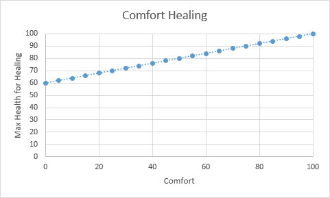

# Comfort

- Credit to Reddit user [u/clickmeimorganic](https://www.reddit.com/u/clickmeimorganic) for the conditions and formula

- For you to be able to regenerate health the following conditions have to be met:

  - Calories > 100
  - Hydration > 40
  - Temperature > 10
  - Last damage taken > 10 seconds ago
  - (Comfort * 40% + 60%) > (Current Health %)

- This leads to the following values for maximum healing

  | Comfort | Maximum HP for Healing |
  | ------- | ---------------------- |
  | 0       | 60                     |
  | 10      | 64                     |
  | 20      | 68                     |
  | 30      | 72                     |
  | 40      | 76                     |
  | 50      | 80                     |
  | 60      | 84                     |
  | 70      | 88                     |
  | 80      | 92                     |
  | 90      | 96                     |
  | 100     | 100                    |

- Visualized as a graph

  