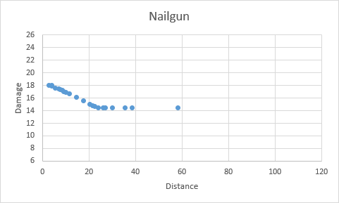

# Damage Dropoff

- Damage dropoff in Rust is calculated based on the ammo type and the multiplier of the weapon used
- Damage dropoff is also applied to Incendiary Ammo's bonus damage, but NOT to Fire Arrows
- Value explanations:

| Value                   | Explanation                                                  |
| ----------------------- | ------------------------------------------------------------ |
| Start Range             | At and before this range, the weapon always deals 100% of the base damage |
| End Range               | At and after this range, the weapon always deals 80% of the base damage |
| Weapon Range Multiplier | The start & end ranges depend on the ammo type. Each weapon has a multiplier that increases/decreases both of these ranges |

## Ammo Stats

| Ammo           | Start Range | End Range |
| -------------- | ----------- | --------- |
| Arrows & Nails | 10          | 60        |
| 9mm Bullets    | 10          | 60        |
| 5.56 Bullets   | 20          | 100       |

## Weapon Stats

| Tier | Weapon                     | Base DM | Range Mult. | Start Range | End Range | Dropoff Graph                               |
| ---- | -------------------------- | ------- | ----------- | ----------- | --------- | ------------------------------------------- |
| 0    | Bow                        | 50      | 100%        | 10          | 60        |           |
| 1    | Nailgun                    | 18      | 40%         | 4           | 24        |       |
| 1    | Crossbow                   | 60      | 150%        | 15          | 90        |      |
| 1    | Compound Bow (Full Charge) | 100     | 200%        | 20          | 200       |  |
| 1    | Revolver                   | 35      | 40%         | 4           | 24        |      |
| 2    | Custom SMG                 | 30      | 70%         | 7           | 42        |        |
| 2    | Thompson                   | 37,5    | 100%        | 10          | 60        |      |
| 2    | Semi-Automatic Rifle       | 40      | 100%        | 20          | 100       |           |
| 2    | Semi-Automatic Pistol      | 40      | 50%         | 5           | 30        |           |
| 2    | Python                     | 55      | 80%         | 8           | 48        |        |
| 3    | MP5A4                      | 35      | 100%        | 10          | 60        |           |
| 3    | Assault Rifle              | 50      | 100%        | 20          | 100       |            |
| 3    | Bolt Action Rifle          | 80      | 175%        | 35          | 175       |           |
| Mil  | LR-300 Assault Rifle       | 40      | 100%        | 20          | 100       |            |
| Mil  | M92                        | 45      | 100%        | 10          | 60        |           |
| Mil  | M39                        | 50      | 150%        | 30          | 150       |           |
| Mil  | M249                       | 65      | 130%        | 26          | 130       |          |
| Mil  | L96                        | 80      | 200%        | 40          | 200       |           |

