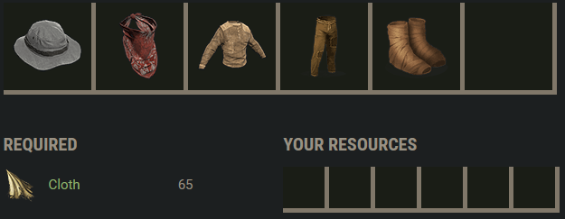

# Rust Gearsets

- This is my list of some gearsets I might want to craft over the course of a wipe.
- In the images you will see the resources required to craft a set. Both "Required" and "Your Resources" are needed. The required resources are separated as I didn't want to put components or gun powder/low grade in the "Required" list because that would have made each entry a lot larger vertically.

## Tier 0

| Type              | Link                                                         | Image                                                  | Additional Notes     |
| ----------------- | ------------------------------------------------------------ | ------------------------------------------------------ | -------------------- |
| Armor             | [Rustlabs Calculator](https://rustlabs.com/craft-calculator#task=bMDzw5FpqD6tSoGMdVy_1AkGD-3YMdzb4LRrmtqok;ingredients=baa) |              | Armor: 20%, 10%, 15% |
| Gear              | [Rustlabs Calculator](https://rustlabs.com/craft-calculator#task=bLCF2GThtWD0jMjhfe9_0WJiibD0OMMvPbWi;ingredients=baa) |  | X                    |
| Tools             | [Rustlabs Calculator](https://rustlabs.com/craft-calculator#task=bIzFxMLUYGDZr_8Gqoe;ingredients=baa) |              | X                    |
| Building Utensils | [Rustlabs Calculator](https://rustlabs.com/craft-calculator#task=bNaF3U3zIaDZFVhvGo3UTzdWo-ZIcuKbz6LCEQafGk;ingredients=baa) |  | X                    |

## Tier 1

### Early

|Type|Link|Image|Additional Notes|
|-----|----|-----|-----|
|Armor| [Rustlabs Calculator](https://rustlabs.com/craft-calculator#task=bPwzw5FpqD6tSoGMdU9DBzfa83pTgIOhE5Zk3ta8-TLmgYdVlwIyMGCo;ingredients=baa) ||Armor: 20%, 20%, 25%|
|Gear 1| [Rustlabs Calculator](https://rustlabs.com/craft-calculator#task=bKpF0smrcGD0jMjhfe9_0WJiib9g;ingredients=bHpF2eUSKGSc) ||X|
|Gear 2| [Rustlabs Calculator](https://rustlabs.com/craft-calculator#task=bKrF0hyYyqD00a36tg3VVCiYcaFag;ingredients=baa) ||30 Scrap @ Bandit Camp (Trade for 3 Water Jugs => Recycle => Go to T1 Workbench and craft)|

### Late

|Type|Link|Image|Additional Notes|
|-----|----|-----|-----|
|Armor|[Rustlabs Calculator](https://rustlabs.com/craft-calculator#task=bPBFwbU0BWD6tSoGMdVOQ1mQao0J8rOQb4UmYTKWo65J_-GhEwTeXna5o;ingredients=bKlFYzRhKWU-QjDzja8-1lBnAdGg)||Armor: 35%, 25%, 30%|
|Gear|[Rustlabs Calculator](https://rustlabs.com/craft-calculator#task=bKpEZxNcta838vqK1Ba_0WJiib9g;ingredients=bIACFSEOInOB35fmehe)||X|

### Special

| Type  | Link                                                         | Image                                        | Additional Notes                                             |
| ----- | ------------------------------------------------------------ | -------------------------------------------- | ------------------------------------------------------------ |
| Armor | [Rustlabs Calculator](https://rustlabs.com/craft-calculator#task=bJEzw5FpqD6tSoGMdTlDZd9hg;ingredients=bHoFYzRhKWCc) |  | Cheap armor for getting into Launch Site or other high radiation monuments, Armor: 25%, 20%, 0%, Rad-Protection: 25%. 100 Scrap to research winter jacket through T1 tech tree, 20 Scrap if you find it. |
|       |                                                              |                                              |                                                              |

## Tier 2

### Early

|Type|Link|Image|Additional Notes|
|-----|----|-----|-----|
|Armor|[Rustlabs Calculator](https://rustlabs.com/craft-calculator#task=bPCFwbU0BWD0fwHLqb4_HE2SihEu3tutG84gzwYyhC9r-FWdVkDH1eWCo;ingredients=bLAFX42dhGD-jMSEtd6-7fTMTb40rlRjihi)||Armor: 35%, 45%, 25%|
|Gear|[Rustlabs Calculator](https://rustlabs.com/craft-calculator#task=bLFF1EuLKWD8DQOsAnGFE5rKea_FWfr-4GSi;ingredients=bLzCFSEOInOECndOcI7n8CcMcf4NNfKbGoi)||Also later on when you have a Spring but no Semi-Body|
|Gear|[Rustlabs Calculator](https://rustlabs.com/craft-calculator#task=bLEE5z5Owa838vqK1BO_0WJiib9-GkJ-Vbyi;ingredients=bLzCFSEOIpGVogH1brDg0Ubtbb4SrQ2Vaoi)||Also later on when you have a Semi-Body but no Spring|

### Late

|Type|Link|Image|Additional Notes|
|-----|----|-----|-----|
|Armor|[Rustlabs Calculator](https://rustlabs.com/craft-calculator#task=bPDEx9gQQG88USkIQdV0c0Ryqo9PSMONb4_6lUXChC9r-FWdVRI_sByoo;ingredients=bJbFX42dhG9FYzRhKXnae)||Armor: 35%, 45%, 45%|
|Gear|[Rustlabs Calculator](https://rustlabs.com/craft-calculator#task=bMbEA058uG87qyDXGpHpVCiYcaFp5cO-8WEai;ingredients=bLDCFSEOIp4pogH1brTdZZIYaWhEXgRw9a5i)||X|

## Tier 3

|Type|Link|Image|Additional Notes|
|-----|----|-----|-----|
|Armor|[Rustlabs Calculator](https://rustlabs.com/craft-calculator#task=bPBCxpygGdVU7WQkOo-1l3THa8YMYAIChF8KU8fWDZXh0-ao_Ul6jTG5o;ingredients=bJbFX42dhG9FYzRhKXpGe)||Armor: 50%, 50%, 45%|
|Gears|[Rustlabs Calculator](https://rustlabs.com/craft-calculator#task=bKsF4ck6JGD-avh-Ed60imo5Wh6Gg;ingredients=bLEC2eYdadVpolida9CFSEOIrQNNdq7aO4Wi)||X|

