# Optimal Burnable Setups

Some optimal setups in your burnables (Refinery, Furnaces) for maximizing yield with the least effort. The highest stacks of the input can always be filled with more resources, but those won't be processed before emptying out the container. The setups with more than one stack of wood are slower and less efficient, but can smelt a lot uninterrupted. Perfect for when you want to go offline and wake up to 6k smelted metal.

- Disclaimer: The large furnace placements with more than one stack would might stop smelting after a stack of charcoal is produced too quickly. Charcoal production is RNG based (75% chance per wood) however the values below are tested to work 99 out of 100 times

## Refinery

| Input                                     | Yield                                                        | Duration [`hh:mm:ss`] | Link                                                         |
| ----------------------------------------- | ------------------------------------------------------------ | --------------------- | ------------------------------------------------------------ |
| 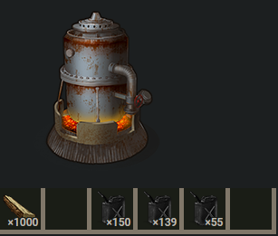 |  1032 Low Grade Fuel | `00:25:00`            | [Rustlabs](https://rustlabs.com/smelter=-1293296287#content=bNlCsgB57v_GebhuY2dHYmS7MwOCorI4uY2dHXU5icam) |

## Large Furnace

| Input                                                 | Yield                                                        | Duration [`hh:mm:ss`] | Link                                                         |
| ----------------------------------------------------- | ------------------------------------------------------------ | --------------------- | ------------------------------------------------------------ |
| 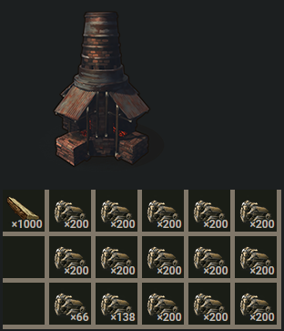      | 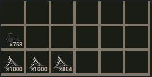 2804 Metal | `00:33:20`            | [Rustlabs](https://rustlabs.com/smelter=-1992717673#content=b4hCsgB57v_Hz8bEPhiwEWxQrYfNSf7KCHz8bEPhiwEWxQrYaqewEWxQrYfNSf7KCHz8bEPhiwEWxQrYfNSf7KCGebfNSf7J5sZ3c0smuS0GVuJKlpyl2i6cZ3c0soqHe) |
| 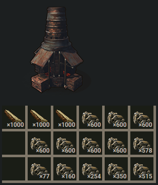  | 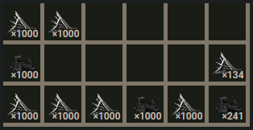 6134 Metal | `01:40:00`            | [Rustlabs](https://rustlabs.com/smelter=-1992717673#content=b5lCsgB57v_HXizVJPx7heHM_oLFOwEWxQvLHz8bEPwwfNSf7Lzybarz8bEPwwfNSf7LzywEWxQvLHz8bEPwwfNSf7Lzcbarz8bEO_AS0GVuJqlpyl2jWbz8bEPoVlpyl2kWqHe) |
| 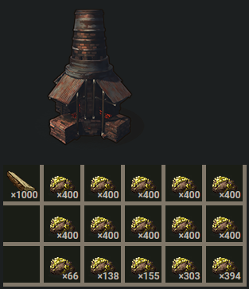     | 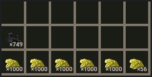 5056 Sulfur | `00:33:20`            | [Rustlabs](https://rustlabs.com/smelter=-1992717673#content=b8ACsgB57v_H0e-5whj6b0e-5whj6b0e-5whj6b0e-5whj6b0e-5whj6aebh1t-HyCNKh1t-HyCNKh1t-HyCNKh1t-HyCNKh1t-HyCNKaqeFrp_fHX9j0e-5whiXt7j-WSorM41t-HyCNl41t-HyCNIGHe) |
| 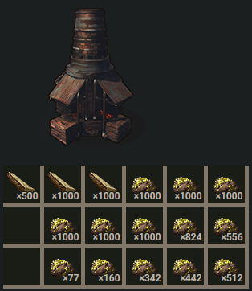 | 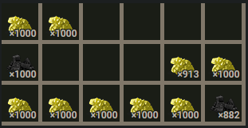 8913 Sulfur, 2.5x the time | `01:23:20`            | [Rustlabs](https://rustlabs.com/smelter=-1992717673#content=b8FCsgB57t_JIqZFhsV1ojdn9Dk-q_IF9ldLFOFrp_fHYV1pON-cW6x7aqeFrp_fHYV1pON-cW6x7h1t-HyCR0d7j-WSovZH0e-5whkXycaJ7j-WSopMVON-cW6gGFrp_fHYDwFrp_fHYE7Frp_fHYSaaHe) |

## Furnace

| Input                                       | Yield                                            | Duration [`hh:mm:ss`] | Link                                                         |
| ------------------------------------------- | ------------------------------------------------ | --------------------- | ------------------------------------------------------------ |
| 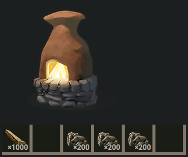  |   | `00:33:20`            | [Rustlabs](https://rustlabs.com/smelter=-1999722522#content=bMyCsgB57v_GebfNSf7KCHz8bEPhiwEWxQrYaqem) |
| 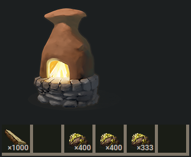 |  | `00:33:20`            | [Rustlabs](https://rustlabs.com/smelter=-1999722522#content=bNwCsgB57v_Gebh1t-HyCNKh1t-HyCNKh1t-HyCNtqqem) |