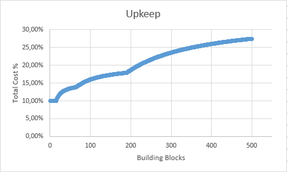

# Upkeep

The details of this mechanic are already [well known](https://www.corrosionhour.com/rust-decay-upkeep-variable/) but I wanted to capture it here as well for easy access  

Base's upkeep cost is based on the connected building blocks (everything you place a building plan, as well as doors and windows) and works in a tax bracket system

| Bracket | Blocks | Cost Multiplier |
| ------- | ------ | --------------- |
| 0       | 1-15   | 10%             |
| 1       | 16-65  | 15%             |
| 2       | 66-190 | 20%             |
| 3       | >190   | 33.333%         |

Depending on the amount of building blocks a total tax will be calculated which you will need to provide upkeep for based on your base's total cost. An example taken from [CorrosionHour](https://www.corrosionhour.com/rust-decay-upkeep-variable/):

```
If a structure has 20 blocks (regardless of building grade), 15 blocks will be taxed at 10%, and 5 will be taxed at 15%, resulting in a total tax of (15 * 10% + 5 * 15%) / 20 = 11.3%.
```

Below is a graph of the total cost % over the amount of building blocks. The cost will asymptotically approach 33.333%

